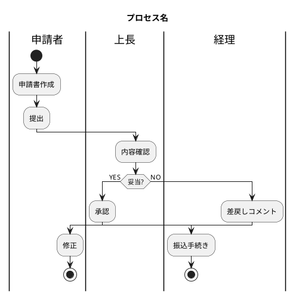

# creating-swimlane-diagrams

業務プロセスをスイムレーン図にする。**PlantUML の activity-beta**（`|レーン|` 構文）で DSL を書き、**kroki.io の公開サーバ**でレンダリングする。

Freedom level: **中**。プロセスの解釈と DSL 構造は文脈で判断、レンダリング手段は固定。

## When to use

- ユーザーが「業務プロセスを図にしたい」「スイムレーンで描いて」と言ったとき
- 複数のアクター（人 / 部署 / システム）の間の情報・モノの受け渡しを可視化したいとき
- 既存のフロー図がレーン分けされていなくて読みづらいとき

Mermaid の subgraph や Miro MCP の `cluster` でも擬似的に描けるが、レーンの帯が連続せず、見た目が業務文書として弱い。**本格的な業務プロセス図を作るならこのスキルを使う。**

## Workflow

### 1. プロセスをヒアリング

不明確な場合は AskUserQuestion で確認する:

- **アクター（レーン）は誰か** — 例: 申請者・上長・経理。3〜5レーンが読みやすい上限
- **開始トリガー** — 例: 「経費が発生したとき」
- **終了条件** — 成功 / 失敗の終了点それぞれ
- **分岐・差戻し** — 何の条件でどう枝分かれするか
- **レーン間の受け渡し物** — 申請書・承認通知・データなど（矢印ラベルになる）

### 2. PlantUML DSL を書く

`assets/template.puml` を雛形にして、プロセス名と内容を差し替える。基本記法は次節「PlantUML スイムレーン記法」を参照。詳細は `references/plantuml-swimlane.md`。

ファイル名は **kebab-case** で `.puml` 拡張子（例: `expense-approval.puml`, `customer-onboarding.puml`）。作業ディレクトリ（cwd）に保存する。

### 3. kroki.io でレンダリング

`scripts/render.sh <input.puml>` を実行すると同名の `.svg` と `.png` が cwd に生成される。

```bash
bash ~/.claude/skills/creating-swimlane-diagrams/scripts/render.sh expense-approval.puml
```

エラーが返ってきたら DSL の構文エラー。kroki のレスポンスにエラー位置が含まれるので確認する。

### 4. 確認とイテレーション

生成された PNG を Read ツールで開いて視覚確認する。レイアウトが崩れていたら次節「トラブルシュート」を参照。

## PlantUML スイムレーン記法（最小セット）



**必須の構造:**
- `@startuml` / `@enduml` で囲む
- `title` で図のタイトル
- `|レーン名|` で現在のレーンを切替（その後のノードはこのレーンに置かれる）
- `start` で開始ノード（黒丸）、`stop` で終了ノード（黒丸＋輪郭）
- `:アクション;` で処理ノード（角丸長方形）
- `if (条件?) then (YES) ... else (NO) ... endif` で分岐
- `repeat ... repeat while (条件?)` でループ
- `fork` / `fork again` / `end fork` で並列処理

**レーン間遷移:** `|別のレーン|` を書いた次のノードが、矢印付きでそのレーンに描画される。レーンをまたぐ矢印は自動配置。

## 業務プロセス記述のコツ

- **レーン = アクター（責任の主体）**。「申請書」みたいなモノ・データはレーンにしない
- **開始ノードは1つ**。複数のトリガーがあるなら別図に分ける
- **動詞 + 目的語** で短く（「申請書を作成する」→「申請書作成」）
- **レーン間の受け渡し** は遷移そのもので表現される。受け渡し物の名前を矢印に乗せたい場合は `-> 申請書;` でラベル付き矢印を書ける
- **5〜15ノード** が読みやすい目安。20を超えたらサブプロセスに分割を検討

## トラブルシュート

### レイアウトが崩れる

- **fork/join が複雑** → `detach` で枝の終端を明示。詳細: `references/plantuml-swimlane.md`
- **レーン順が思った順にならない** → 最初に登場した順がデフォルト。順序を制御したいときは図の冒頭で全レーンを宣言する:
  ```
  |申請者|
  |上長|
  |経理|
  ```
  これで `|申請者|` → `|上長|` → `|経理|` の順に並ぶ
- **矢印が重なる** → ノードを増やしすぎ。プロセスを分割する

### kroki エラー

- `400 Bad Request` → DSL の構文エラー。レスポンス本文を読む
- タイムアウト → ノード数が多すぎ。100超のノードはローカル PlantUML JAR で描く

## 出力先と取り込み

- 生成物（`.puml`, `.svg`, `.png`）は **cwd に保存**。リポジトリ管理したい場合はそのまま `git add`
- **Miro / Figma / Notion へ貼る場合は手動アップロード**（PNG をドラッグ&ドロップ）。Miro MCP には画像アップロードツールが現状無い
- **GitHub の issue/PR に貼る場合**は SVG または PNG をコメント欄にドラッグ

## ファイル構成

```
creating-swimlane-diagrams/
├── SKILL.md
├── assets/
│   └── template.puml          # コピペ用テンプレ
├── scripts/
│   └── render.sh              # kroki POST ラッパー
└── references/
    └── plantuml-swimlane.md   # 詳細シンタックス・例集
```
