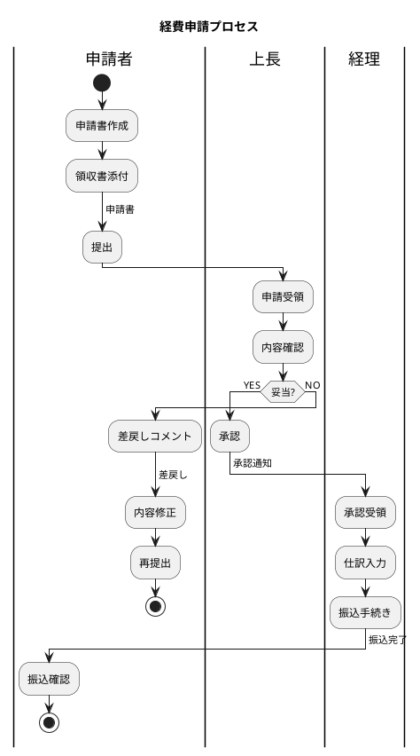

# PlantUML スイムレーン詳細リファレンス

PlantUML の **activity-beta** 構文（`@startuml` 〜 `@enduml` の中で `start` / `:アクション;` / `stop` を使う形式）でのスイムレーン記法をまとめる。古い activity 構文（`(*) -->` 形式）はサポート外。

## レーン操作

### 基本
```plantuml
|レーン名|
:このレーンのアクション;
```

### レーン順序の固定
最初に登場した順がデフォルトだが、図の冒頭で全レーンを宣言すると順序を制御できる:
```plantuml
@startuml
|顧客|
|営業|
|倉庫|

|顧客|
start
:注文;
...
```

### レーンの色付け
```plantuml
|#LightBlue|顧客|
|#LightGreen|営業|
```
標準の HTML 色名が使える。

## 制御構造

### 分岐 (if / elseif / else)
```plantuml
if (在庫あり?) then (yes)
  :出荷;
elseif (発注可能?) then (yes)
  :発注;
  :入荷待ち;
else (no)
  :欠品連絡;
endif
```

### ループ (repeat / while)
```plantuml
repeat
  :作業実施;
  :チェック;
repeat while (不合格?) is (yes) not (no)
:完了;
```

```plantuml
while (待機中?)
  :ポーリング;
endwhile
:検出;
```

### 並列処理 (fork / fork again)
```plantuml
fork
  :メール送信;
fork again
  :Slack通知;
fork again
  :ログ記録;
end fork
:後続処理;
```

### サブプロセス (partition)
レーン内で論理ブロックを区切りたいとき:
```plantuml
|営業|
partition "受注処理" {
  :見積作成;
  :承認取得;
  :受注確定;
}
```

## 矢印・ラベル

### ラベル付き矢印
```plantuml
:申請書作成;
-> 申請書;
:提出;
```
`-> ラベル;` で次のノードへの矢印にラベルが付く。レーンをまたぐ受け渡し物（書類・データ・モノ）の名前を書くのに使う。

### 終端の手動制御
分岐の片側で本流から外れて終わらせたい場合:
```plantuml
if (キャンセル?) then (yes)
  :キャンセル処理;
  stop
else (no)
endif
:本流継続;
```
`stop` を使うとそこで枝が終了する。`detach` を使うと矢印自体を切ることもできる:
```plantuml
:警告;
detach
```

## レイアウトの罠と対処

### fork が複雑になると崩れる
3本以上の fork で、各枝の長さがバラバラだと矢印がぐちゃぐちゃになる。対処:

1. **partition で枝を囲む** — fork 内の各枝を partition でくくると整列する
2. **枝を1〜2ステップに収める** — 長くなる枝はサブプロセス図に分離
3. **end fork に行き先を書く** — `end fork {次のステップ名}` でジョイン後の合流先を明示

### レーンが意図せず追加される
タイポで `|営業 |` のように末尾スペースが入ると別レーンとして認識される。レーン宣言は厳密に同じ文字列を使う。

### 縦長になりすぎる
ノード数が 20 を超えると PNG が縦に間延びして読みにくい。対策:

- **横方向に展開する**: `left to right direction` を `@startuml` 直後に書く（ただしスイムレーンとは相性が悪く、レーンが帯になりにくい）
- **サブプロセス分割**: 「受注 → 出荷 → 請求」のような大プロセスは3図に分ける
- **スキン調整**: `skinparam ranksep 30` `skinparam nodesep 20` で間隔を縮める

### 日本語が文字化け
kroki.io 経由なら問題ないが、ローカル PlantUML で起きたら `-charset UTF-8` オプションを付ける。

## 完成例: 経費申請プロセス



## 参考

- [PlantUML Activity Diagram Beta 公式](https://plantuml.com/activity-diagram-beta)
- [Kroki PlantUML](https://docs.kroki.io/kroki/setup/diagrams/plantuml/)
- [arc42 Tip 6-7: Activity diagrams with swimlanes](https://docs.arc42.org/tips/6-7/)
