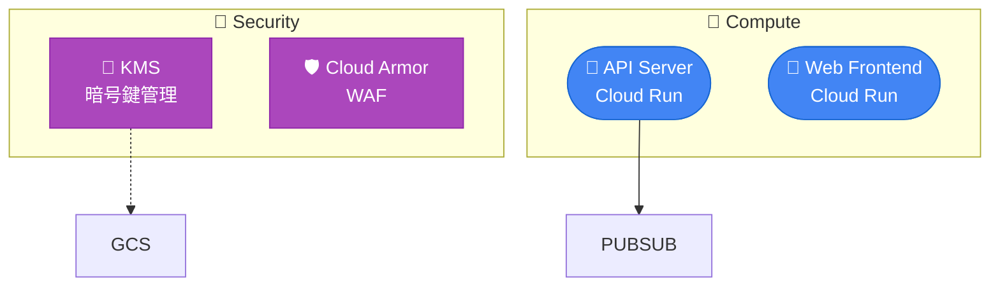

# Terraform → Mermaid 構成図生成

Terraform の HCL ファイルを読み取り、モジュール間の依存関係を Mermaid フローチャートとして生成する。

## Freedom Level: 中

推奨パターンに従いつつ、プロジェクトの規模や構成に応じてレイアウトを調整する。

## 手順

### 1. Terraform ファイルの探索

```bash
# ルートの main.tf を探す
find . -name "main.tf" -path "*/terraform/*" | head -5
# モジュール構成を確認
ls terraform/modules/ 2>/dev/null || ls modules/ 2>/dev/null
```

### 2. 依存関係の抽出

ルートの `main.tf` から以下を読み取る:

- **モジュール定義**: `module "xxx" { source = "./modules/yyy" }` → ノード
- **モジュール間参照**: `module.kms.scans_key_id` → エッジ（kms → 参照元）
- **変数の意味**: 変数名からデータフローの種類を推定（`_bucket` → ストレージ、`_topic` → メッセージング、`_key` → 暗号化）

各モジュールの `main.tf` も読み、中のリソース種別（`google_cloud_run_v2_service` 等）からカテゴリを特定する。

### 3. Mermaid の生成

GCP リソースのアイコン・色分けは [references/gcp-icons.md](references/gcp-icons.md) を参照。AWS 用の対応表は未整備なので、AWS リソースは emoji・色分けをその場で即興的に決めるしかない（出力のブレを許容する）。

#### 構成ルール

- **方向**: `flowchart TB`（上から下）を基本とし、横長なら `LR`
- **ノード**: モジュール単位。emoji + 名前で表現
- **エッジ**: 依存の種類で線種を変える
  - データフロー（バケット、トピック）: `-->`
  - 認証・暗号化（KMS鍵、SA）: `-.->`
  - 構成依存（イメージURL、環境変数）: `==>`
- **サブグラフ**: 関連モジュールをカテゴリでグルーピング
- **classDef**: カテゴリ別に色分け

#### 出力テンプレート

````markdown
# Infrastructure Diagram


````

### 4. 出力

- Mermaid コードブロックを含む `.md` ファイルとして保存
- デフォルトの出力先: プロジェクトルートの `docs/infrastructure.md`
- ユーザーが指定した場合はそのパスに保存

### 5. プレビュー確認

出力後、ユーザーに以下を案内:
- VS Code: Mermaid Preview 拡張で即時プレビュー
- CLI: `npx @mermaid-js/mermaid-cli mmdc -i docs/infrastructure.md -o docs/infrastructure.png`
- GitHub: `.md` ファイルを push すれば自動レンダリング

## 注意点

- IAM バインディングやサービスアカウントは省略し、主要リソースの依存のみを図示する
- ノード数が 15 を超える場合はサブグラフで整理する
- tfstate がない場合でも HCL だけで生成可能
